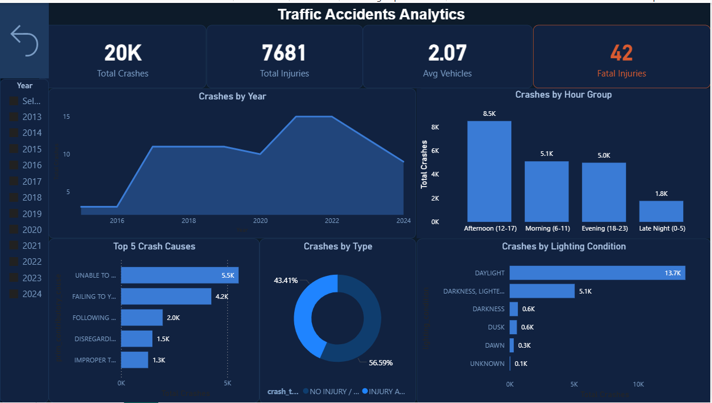

# Traffic-Accident-Big-Data-Analytics
An end-to-end Big Data analytics project for traffic accident analysis using PySpark, PostgreSQL, Random Forest, XGBoost, and Power BI.

# 🚦 Traffic Accident Big Data Analytics

## 📌 Project Overview

This project presents a complete Big Data analytics pipeline for analyzing traffic accident records and predicting accident severity.

The solution combines distributed data processing, cloud storage, machine learning, and interactive visualization to generate meaningful insights for road safety analysis.

---

## 🚀 Technologies

- Python
- Apache PySpark
- PostgreSQL (Supabase)
- SQLAlchemy
- Scikit-learn
- XGBoost
- Power BI

---

## 📊 Project Pipeline

Raw Dataset

↓

Data Ingestion (Python + SQLAlchemy)

↓

Cloud Storage (Supabase PostgreSQL)

↓

Distributed Processing (PySpark)

↓

Machine Learning

- Random Forest Classifier
- XGBoost Regressor

↓

Power BI Dashboard

---

## 📈 Dashboard Features

- Crash trends
- Weather analysis
- Lighting conditions
- Injury statistics
- Contributing factors
- Interactive filtering

---

## 🤖 Machine Learning Models

### Random Forest

Predicts whether an accident is severe.

### XGBoost

Predicts the total number of injuries.

---

## 👩‍💻 My Contribution

- Data preprocessing
- Big Data pipeline implementation
- Machine learning
- Dashboard development
- Report writing
- Result analysis

---

## 📷 Dashboard Preview

(Add dashboard screenshot here)
